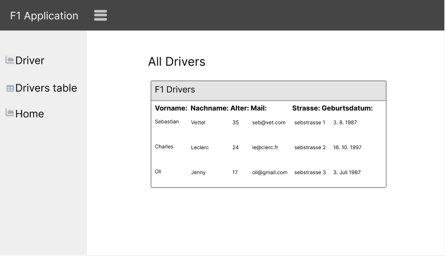

= Formel 1

== Warum haben wir uns für F1 entschieden?

Da wir alle Formel 1 mögen und weil Joey mit Noel schon eine F1 Application mit React gemacht hatten, entschieden wir uns dazu, dassselbe mit Thymleaf zu machen.

== Was kann unser Programm?

Mit F1 App kann man auf dem Tab "Driver" Fahrer abspeichern. Dazu muss man den Namen, Alter, Mail, Strasse und Geburtsdatum eingeben. Bei Fehlern wird das auch direkt angezeigt.

Um die gespeicherten Fahrer anzuschauen, kann man auf den "Driver Table" Tab gehen und dort ist eine Tabelle mit allen F1 Fahrern.

Zudem zeigt unser Programm je nach im Browser eingestellter Sprache den entsprechenden Text an.

== Usecases

=== UC-1 neuer Fahrer

Ich möchte einen neuen Fahrer hinzufügen.
Ich will selber entscheiden wie der Fahrer heisst etc.

=== Sequenz

.Sequenz neuer Fahrer
[plantuml]
----
@startuml

actor user

user -> backend : POST driver
note right: Alle Attribute manuell hinzufügen
backend -> user : 200
note left: Neuer Driver erstellt

@enduml
----

=== UC-2 neuer Fahrer mit invaliden Attributen

Ich möchte einen neuen Fahrer hinzufügen.
ich gebe invalide Daten an.

=== Sequenz

.Sequenz neuer Fahrer mit invaliden Attributen
[plantuml]
----
@startuml

actor user

user -> backend : POST driver
note right: Falsche Attribute manuell hinzufügen
backend -> user : Fehler wird erkannt
note left: Fehlermeldung wird angezeigt

@enduml
----

=== UC-3 Alle erstellten Driver anschauen

Ich möchte alle Erstellten Fahrer anschauen und ihre Infos wissen.

=== Sequenz

.Alle erstellten Driver anschauen
[plantuml]
----
@startuml

actor user

user -> backend: klicken auf link zu "Drivers table"
note right: neue Seite wird geöffnet
backend -> user : Alles Fahrer aufzeigen
note left: Alle Fahrer sind in der Tabelle

@enduml
----

=== UC-4 Reset Knopf

Ich möchte einen falschen Fahrer auf der "Driver" Seite
erstellen, merke allerdings bevor ich ihn abschicke,
dass es der falsche ist.

=== Sequenz

.Reset Knopf
[plantuml]
----
@startuml

actor user

user -> backend: Reset Knopf
note right: Falscher Fahrer eingegeben
backend -> user : Eingaben leeren
note left: Man kann einen anderen Fahrer erstellen

@enduml
----

== Skizzen

=== Layout

=== GUI

==== Home

==== Driver

==== Drivers table

